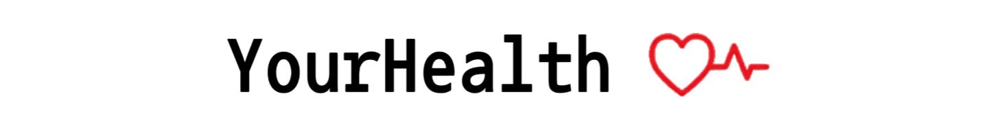

  

**YourHealth** es una plataforma en desarrollo enfocada en la gestión de entrenadores personalizados.  
Actualmente el proyecto se encuentra en construcción, con el **frontend** como primera parte implementada.  

---

## 🚧 Estado del proyecto
- En proceso de desarrollo  
- Frontend inicial en React completado (menú de navegación y página de inicio)  
- Backend pendiente de construcción (MongoDB, Express, Node.js)  

---

## 🛠️ Tecnologías utilizadas

  
  
  
  
  

---

## 📌 Próximos pasos
- Completar la integración del backend (API con Node + Express + MongoDB).  
- Implementar autenticación de usuarios.  
- Agregar funcionalidades de agendamiento de entrenamientos.  

---

## 📸 Créditos de recursos
Imágenes: [Pexels](https://www.pexels.com), [Freepik](https://www.freepik.com)  
Íconos: [Flaticon](https://www.flaticon.com)  

---

## 👩‍💻 Autor
Proyecto desarrollado por **Ailyn** 

## 📌 Notas

La estructura y funcionamiento han sido aprendidos y adaptados a partir de tutoriales del canal [GreatStack](https://www.youtube.com/@GreatStackDev).  
El diseño visual, colores, distribución y la marca **YourHealth** son propios y creados de manera original para este proyecto.

